# Recipe App 🍳

A modern React Native application for discovering and managing recipes. Built with TypeScript, Redux Toolkit, and Firebase integration for a seamless cooking experience.

## 📱 Features

### Core Functionality

- **Recipe Discovery**: Browse recipes by alphabetical letters
- **Advanced Search**: Search recipes by name with real-time filtering
- **Recipe Details**: View detailed information including ingredients and cooking instructions
- **Favorites Management**: Save and manage your favorite recipes with real-time synchronization
- **Theme Support**: Toggle between light and dark modes with persistent settings

### User Experience

- **Responsive Design**: Optimized for both iOS and Android devices
- **Smooth Navigation**: Tab-based navigation with stack navigation for details
- **Real-time Updates**: Firebase integration for instant favorites synchronization
- **Performance Optimized**: Lazy loading, memoization, and efficient list rendering

## 🛠 Technology Stack

### Frontend

- **React Native** - Cross-platform mobile development
- **TypeScript** - Type-safe development
- **React Navigation v6** - Navigation management
- **React Native Safe Area Context** - Safe area handling

### State Management

- **Redux Toolkit** - Global state management
- **React-Redux** - React bindings for Redux
- **Redux Persist** - State persistence

### Backend & Data

- **Firebase Firestore** - Real-time database for favorites
- **TheMealDB API** - Recipe data source
- **Axios** - HTTP client for API requests

### UI & Styling

- **Lucide React Native** - Modern icon library
- **Custom Theme System** - Light/dark mode support
- **Utility-based Styling** - Reusable style components

## 📂 Project Structure

```
src/
├── navigation/           # Navigation configuration
│   ├── AppNavigator.tsx    # Main navigation stack
│   └── TabNavigator.tsx    # Bottom tab navigation
├── components/           # Reusable components
│   └── RecipeCard/         # Recipe card component
├── screens/             # Application screens
│   ├── home/              # Home screen with alphabet filter
│   ├── search/            # Recipe search functionality
│   ├── favorites/         # Favorites management
│   ├── details/           # Recipe details view
│   ├── settings/          # App settings
│   └── splash/            # Splash screen
├── redux/               # State management
│   ├── store.ts           # Redux store configuration
│   └── slice/             # Redux slices
│       ├── mealSlice.ts      # Recipes state
│       ├── favoriteSlice.ts  # Favorites state
│       ├── detailSlice.ts    # Recipe details state
│       └── settingsSlice.ts  # App settings state
├── service/             # External services
│   └── firebaseService.ts # Firebase integration
├── hooks/               # Custom React hooks
│   └── useTheme.ts        # Theme management hook
├── theme/               # Theme configuration
│   └── theme.ts           # Light/dark theme definitions
├── styles/              # Styling utilities
│   └── utilityStyles.ts   # Reusable style utilities
├── utils/               # Utility functions
│   ├── constants.ts       # App constants
│   └── uiText.ts         # UI text constants
└── assets/              # Static assets
    └── logo/              # App logo and images
```

## 🚀 Getting Started

### Prerequisites

- Node.js (v16 or later)
- React Native CLI
- Android Studio (for Android)
- Xcode (for iOS)
- Firebase project setup

### Installation

1. **Clone the repository**

   ```bash
   git clone <repository-url>
   cd recipe-app
   ```

2. **Install dependencies**

   ```bash
   npm install
   # or
   yarn install
   ```

3. **Configure Firebase**

   - Create a Firebase project at [Firebase Console](https://console.firebase.google.com)
   - Enable Firestore Database
   - Create `src/service/config.json` with your Firebase configuration:

   ```json
   {
     "apiKey": "your-api-key",
     "authDomain": "your-auth-domain",
     "projectId": "your-project-id",
     "storageBucket": "your-storage-bucket",
     "messagingSenderId": "your-messaging-sender-id",
     "appId": "your-app-id"
   }
   ```

4. **iOS Setup** (iOS only)

   ```bash
   cd ios && pod install && cd ..
   ```

5. **Run the application**

   ```bash
   # For Android
   npx react-native run-android

   # For iOS
   npx react-native run-ios
   ```

## 📸 Screenshots

### App Overview

#### **Splash Screen**

| Android                                                                                         | iOS                                                                                     |
| ----------------------------------------------------------------------------------------------- | --------------------------------------------------------------------------------------- |
|  | 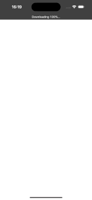 |

#### **Home Screen**

| Android                                                                                     | iOS                                                                                 |
| ------------------------------------------------------------------------------------------- | ----------------------------------------------------------------------------------- |
| 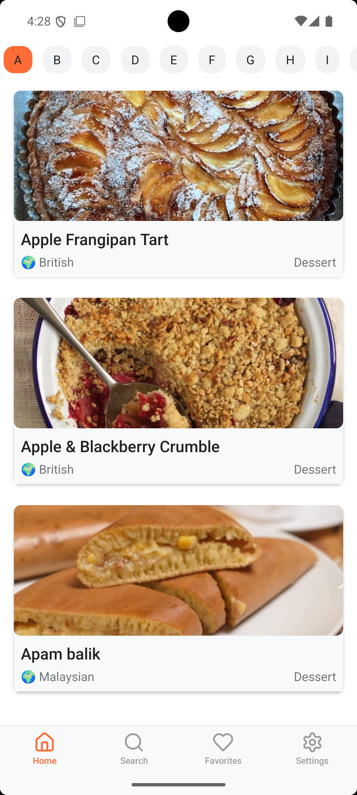 | 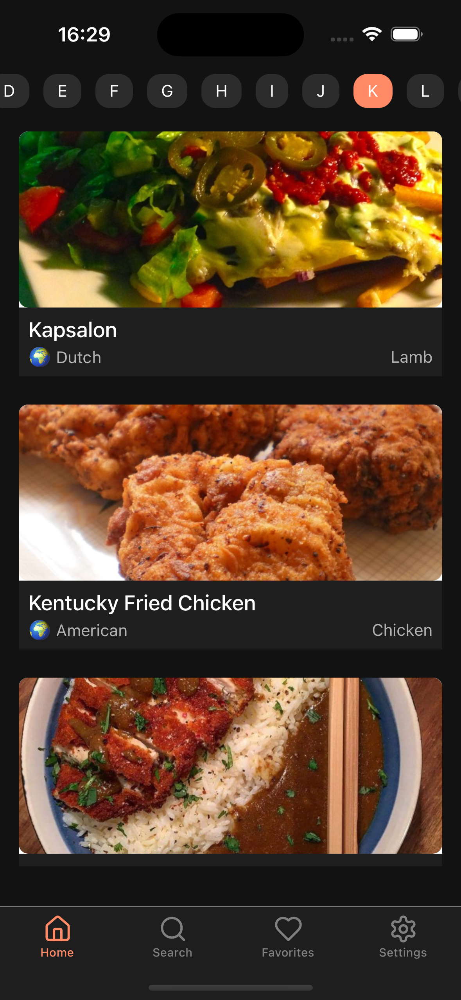 |

### Navigation & Discovery

#### **Alphabet Filter**

| Android                                                                                                    | iOS                                                                                                |
| ---------------------------------------------------------------------------------------------------------- | -------------------------------------------------------------------------------------------------- |
| 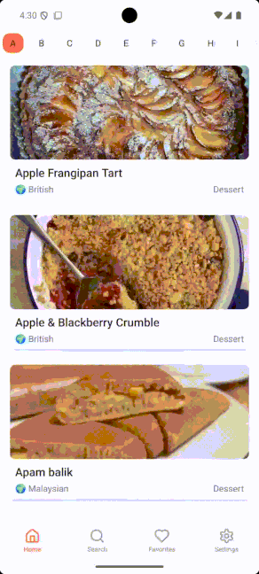 | 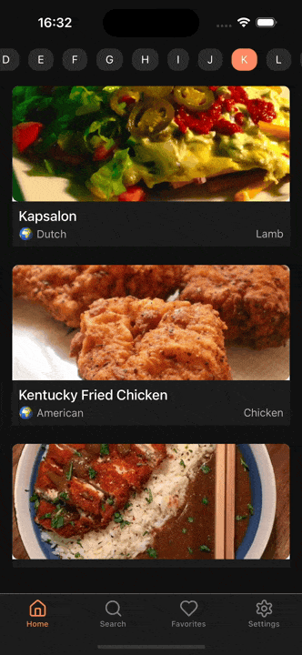 |

#### **Search Screen**

| Android                                                                                         | iOS                                                                                     |
| ----------------------------------------------------------------------------------------------- | --------------------------------------------------------------------------------------- |
| 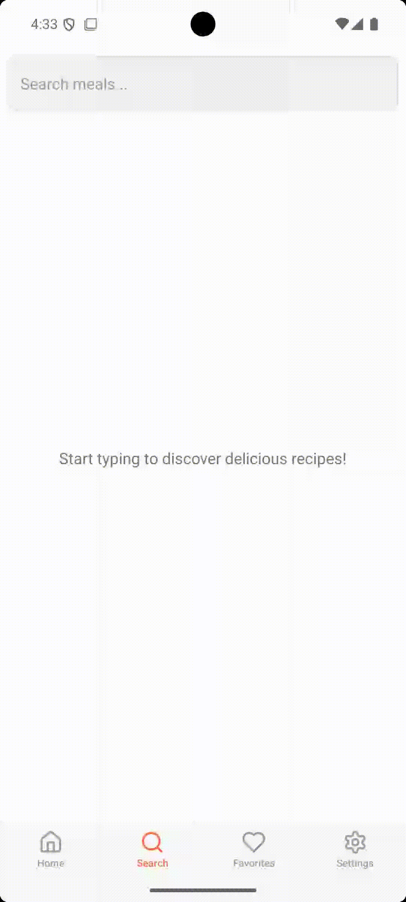 | 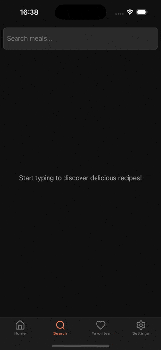 |

### Recipe Details

#### **Recipe Details**

| Android                                                                                                  | iOS                                                                                              |
| -------------------------------------------------------------------------------------------------------- | ------------------------------------------------------------------------------------------------ |
| 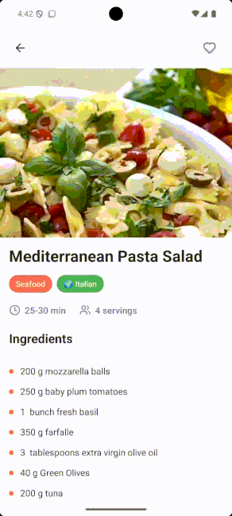 | 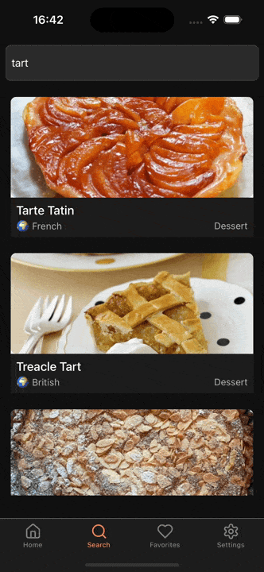 |

### Favorites Management

#### **Favorites Screen**

| Android                                                                                               | iOS                                                                                           |
| ----------------------------------------------------------------------------------------------------- | --------------------------------------------------------------------------------------------- |
| 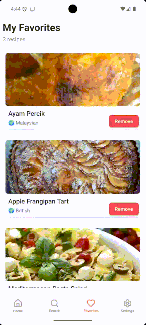 | 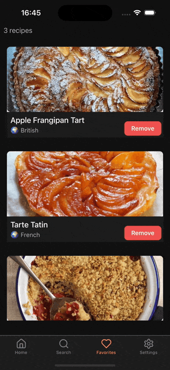 |

### Settings & Theme

#### **Settings Screen**

| Android                                                                                             | iOS                                                                                         |
| --------------------------------------------------------------------------------------------------- | ------------------------------------------------------------------------------------------- |
| 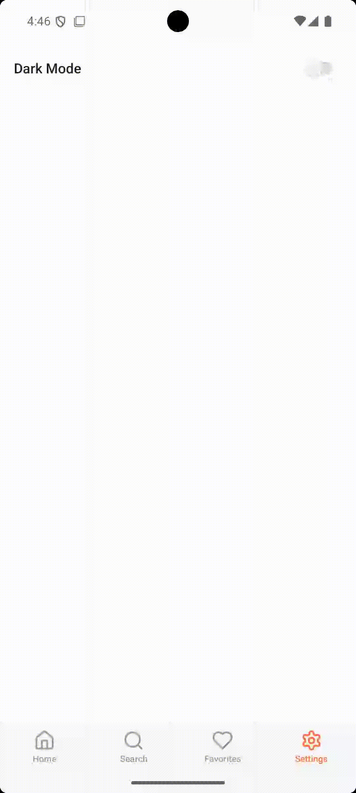 | 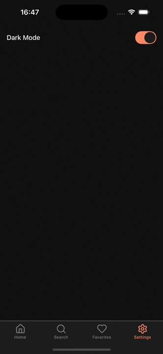 |

## 🏗 Architecture

### State Management Flow

The app uses Redux Toolkit for centralized state management with the following slices:

- **Meals Slice**: Manages recipe data, categories, and search results
- **Favorites Slice**: Handles user's favorite recipes with Firebase sync
- **Details Slice**: Manages detailed recipe information and favorite status
- **Settings Slice**: Controls app settings like theme mode

### Navigation Structure

```
AppNavigator (Stack)
├── Splash Screen
├── Main (Tab Navigator)
│   ├── Home Tab
│   ├── Search Tab
│   ├── Favorites Tab
│   └── Settings Tab
└── Details Screen (Modal)
```

### Firebase Integration

- **Real-time Favorites**: Uses Firestore listeners for instant synchronization
- **User Identification**: Generates unique UUIDs for anonymous users
- **Offline Support**: Firebase handles offline data synchronization

## 🎨 Theming

The app supports both light and dark themes with:

- Dynamic color switching
- Persistent theme preferences
- Consistent styling across all components
- Utility-based style system for easy maintenance

## 🔧 Key Features Implementation

### Recipe Search

- Debounced search input (500ms delay)
- Minimum 3 characters for search activation
- Real-time results from TheMealDB API
- Loading states and error handling

### Favorites System

- Firebase Firestore for persistent storage
- Real-time synchronization across devices
- Optimistic UI updates for better UX
- Anonymous user support with UUID generation

### Performance Optimizations

- FlatList with optimized rendering props
- Memoized components and callbacks
- Image lazy loading
- Efficient re-rendering with proper dependencies

## 📱 API Integration

### TheMealDB API Endpoints

- **Categories**: `/list.php?c=list`
- **Areas**: `/list.php?a=list`
- **Search by Name**: `/search.php?s={query}`
- **Search by First Letter**: `/search.php?f={letter}`
- **Meal Details**: `/lookup.php?i={id}`
- **Filter by Category**: `/filter.php?c={category}`

## 🧪 Testing

The app includes:

- Type safety with TypeScript
- Error boundaries for crash prevention
- Loading states for all async operations
- Fallback UI for error scenarios

## 🔒 Privacy & Security

- No user authentication required
- Anonymous user identification
- Local data storage with AsyncStorage
- Firebase security rules for data protection

## 🤝 Contributing

1. Fork the repository
2. Create a feature branch (`git checkout -b feature/amazing-feature`)
3. Commit your changes (`git commit -m 'Add some amazing feature'`)
4. Push to the branch (`git push origin feature/amazing-feature`)
5. Open a Pull Request

## 🙏 Acknowledgments

- [TheMealDB](https://www.themealdb.com/) for providing the recipe API
- [Lucide](https://lucide.dev/) for the beautiful icon set
- [Firebase](https://firebase.google.com/) for backend services
- React Native community for excellent documentation and support

## 📞 Support

If you encounter any issues or have questions:

- Create an issue in this repository
- Check the [React Native documentation](https://reactnative.dev/docs/getting-started)
- Review [Firebase documentation](https://firebase.google.com/docs)

---

**Made with ❤️ and React Native**
